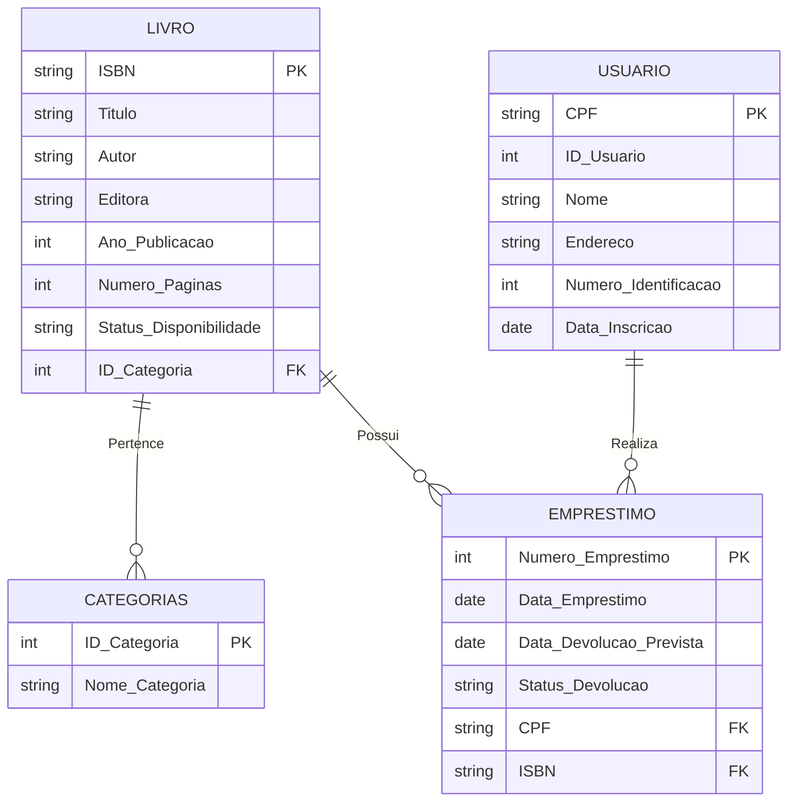

```mermaid
erDiagram
    LIVRO {
        string ISBN PK
        string Titulo
        string Autor
        string Editora
        int Ano_Publicacao
        int Numero_Paginas
        string Status_Disponibilidade
        int ID_Categoria FK
    }

    USUARIO {
        string CPF PK
        int ID_Usuario
        string Nome
        string Endereco
        int Numero_Identificacao
        date Data_Inscricao
    }

    EMPRESTIMO {
        int Numero_Emprestimo PK
        date Data_Emprestimo
        date Data_Devolucao_Prevista
        string Status_Devolucao
        string CPF FK
        string ISBN FK
    }

    CATEGORIAS {
        int ID_Categoria PK
        string Nome_Categoria
    }

    LIVRO ||--o{ CATEGORIAS : Pertence
    USUARIO ||--o{ EMPRESTIMO : Realiza
    LIVRO ||--o{ EMPRESTIMO : Possui
```