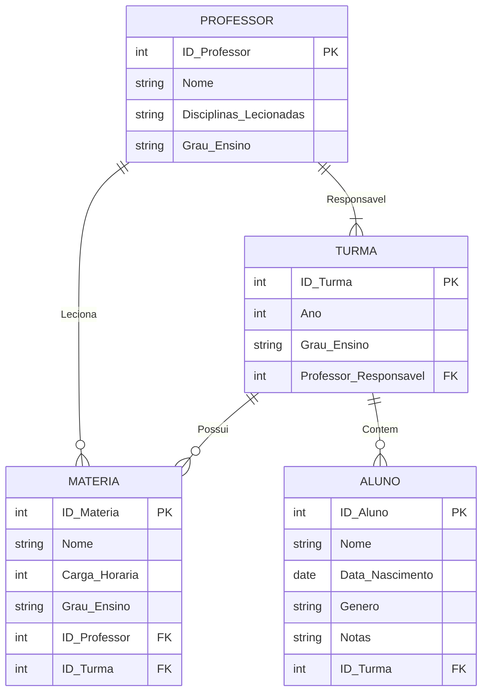

```mermaid

erDiagram
    ALUNO {
        int ID_Aluno PK
        string Nome
        date Data_Nascimento
        string Genero
        string Notas
        int ID_Turma FK
    }

    PROFESSOR {
        int ID_Professor PK
        string Nome
        string Disciplinas_Lecionadas
        string Grau_Ensino
    }

    MATERIA {
        int ID_Materia PK
        string Nome
        int Carga_Horaria
        string Grau_Ensino
        int ID_Professor FK
        int ID_Turma FK
    }

    TURMA {
        int ID_Turma PK
        int Ano
        string Grau_Ensino
        int Professor_Responsavel FK
    }

    TURMA ||--o{ ALUNO : Contem
    PROFESSOR ||--o{ MATERIA : Leciona
    TURMA ||--o{ MATERIA : Possui
    PROFESSOR ||--|{ TURMA : Responsavel


```