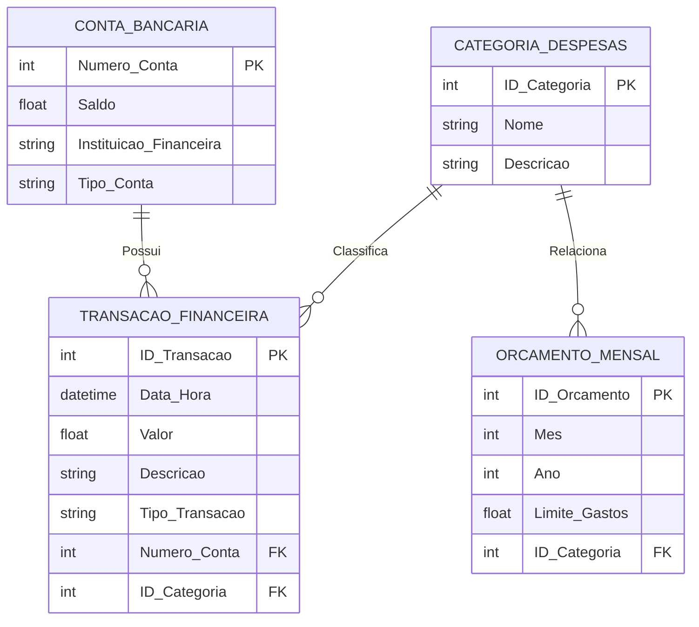

```mermaid

erDiagram
    CONTA_BANCARIA {
        int Numero_Conta PK
        float Saldo
        string Instituicao_Financeira
        string Tipo_Conta
    }

    TRANSACAO_FINANCEIRA {
        int ID_Transacao PK
        datetime Data_Hora
        float Valor
        string Descricao
        string Tipo_Transacao
        int Numero_Conta FK
        int ID_Categoria FK
    }

    CATEGORIA_DESPESAS {
        int ID_Categoria PK
        string Nome
        string Descricao
    }

    ORCAMENTO_MENSAL {
        int ID_Orcamento PK
        int Mes
        int Ano
        float Limite_Gastos
        int ID_Categoria FK
    }

    CONTA_BANCARIA ||--o{ TRANSACAO_FINANCEIRA : Possui
    CATEGORIA_DESPESAS ||--o{ TRANSACAO_FINANCEIRA : Classifica
    CATEGORIA_DESPESAS ||--o{ ORCAMENTO_MENSAL : Relaciona

```