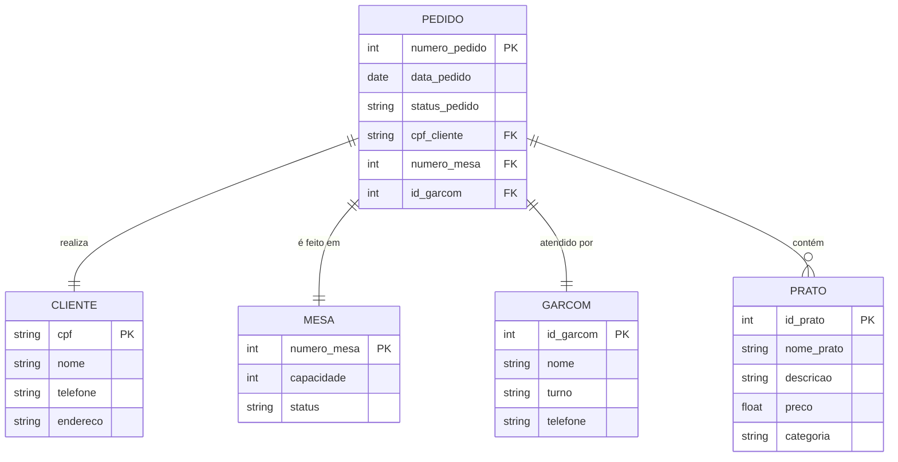

```mermaid
erDiagram
    MESA {
      int numero_mesa PK
      int capacidade
      string status
    }
    GARCOM {
      int id_garcom PK
      string nome
      string turno
      string telefone
    }
    CLIENTE {
      string cpf PK
      string nome
      string telefone
      string endereco
    }
    PEDIDO {
      int numero_pedido PK
      date data_pedido
      string status_pedido
      string cpf_cliente FK
      int numero_mesa FK
      int id_garcom FK
    }
    PRATO {
      int id_prato PK
      string nome_prato
      string descricao
      float preco
      string categoria
    }
    
    PEDIDO ||--|| CLIENTE : "realiza"
    PEDIDO ||--|| MESA : "é feito em"
    PEDIDO ||--|| GARCOM : "atendido por"
    PEDIDO ||--o{ PRATO : "contém"

```