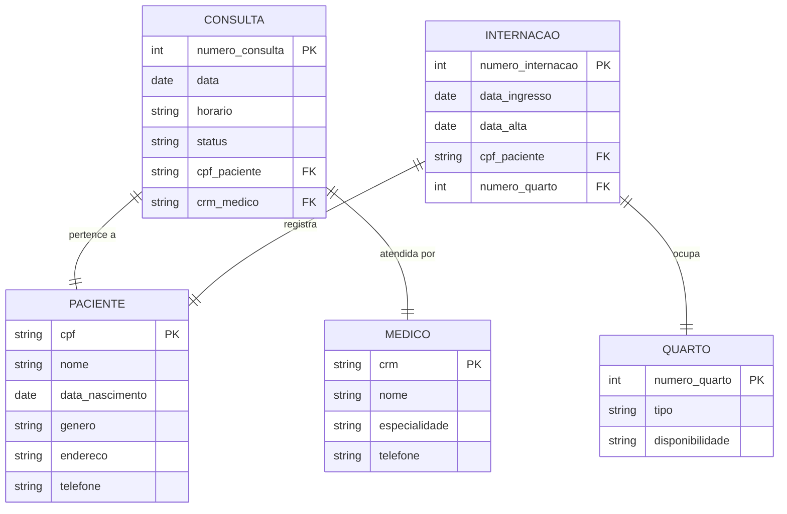

```mermaid
erDiagram
    PACIENTE {
      string cpf PK
      string nome
      date data_nascimento
      string genero
      string endereco
      string telefone
    }
    MEDICO {
      string crm PK
      string nome
      string especialidade
      string telefone
    }
    CONSULTA {
      int numero_consulta PK
      date data
      string horario
      string status
      string cpf_paciente FK
      string crm_medico FK
    }
    QUARTO {
      int numero_quarto PK
      string tipo
      string disponibilidade
    }
    INTERNACAO {
      int numero_internacao PK
      date data_ingresso
      date data_alta
      string cpf_paciente FK
      int numero_quarto FK
    }

    CONSULTA ||--|| PACIENTE : "pertence a"
    CONSULTA ||--|| MEDICO : "atendida por"
    INTERNACAO ||--|| PACIENTE : "registra"
    INTERNACAO ||--|| QUARTO : "ocupa"

```