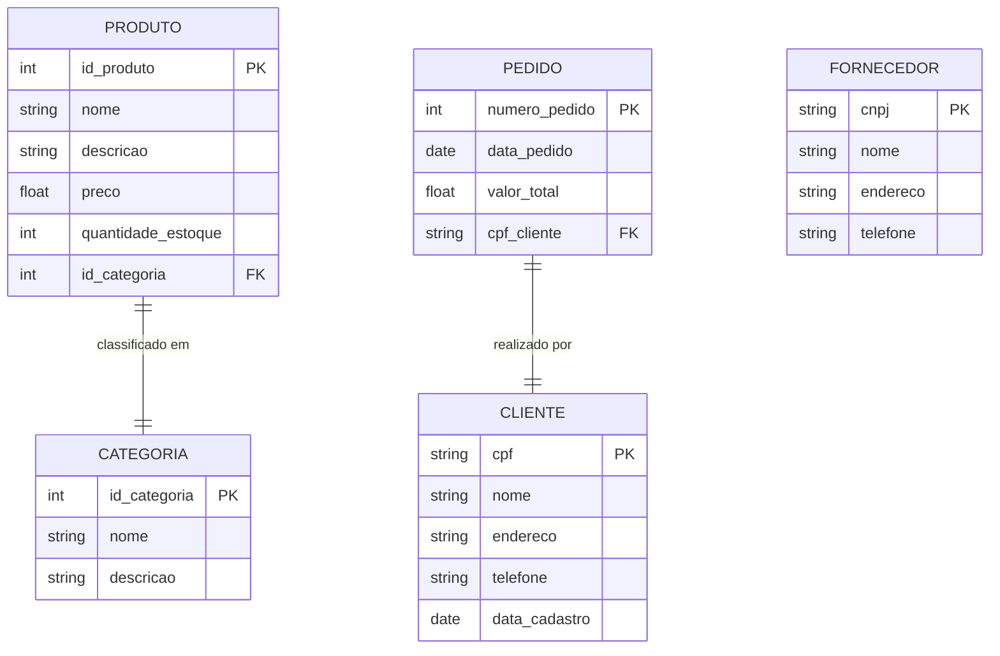

```mermaid
erDiagram
    PRODUTO {
      int id_produto PK
      string nome
      string descricao
      float preco
      int quantidade_estoque
      int id_categoria FK
    }
    CLIENTE {
      string cpf PK
      string nome
      string endereco
      string telefone
      date data_cadastro
    }
    PEDIDO {
      int numero_pedido PK
      date data_pedido
      float valor_total
      string cpf_cliente FK
    }
    CATEGORIA {
      int id_categoria PK
      string nome
      string descricao
    }
    FORNECEDOR {
      string cnpj PK
      string nome
      string endereco
      string telefone
    }

    PRODUTO ||--|| CATEGORIA : "classificado em"
    PEDIDO ||--|| CLIENTE : "realizado por"

```