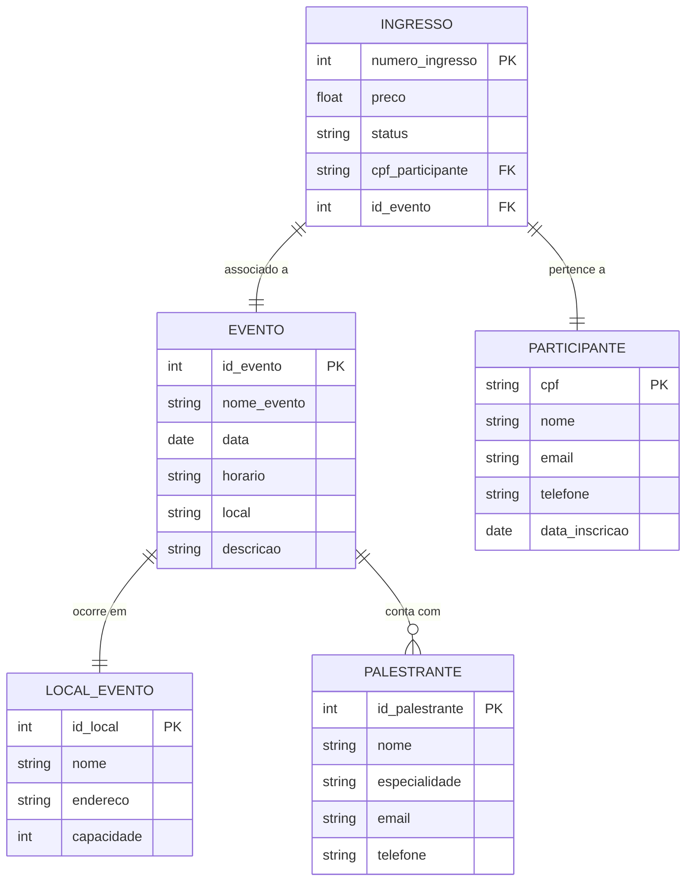

```mermaid
erDiagram
    EVENTO {
      int id_evento PK
      string nome_evento
      date data
      string horario
      string local
      string descricao
    }
    PARTICIPANTE {
      string cpf PK
      string nome
      string email
      string telefone
      date data_inscricao
    }
    INGRESSO {
      int numero_ingresso PK
      float preco
      string status
      string cpf_participante FK
      int id_evento FK
    }
    LOCAL_EVENTO {
      int id_local PK
      string nome
      string endereco
      int capacidade
    }
    PALESTRANTE {
      int id_palestrante PK
      string nome
      string especialidade
      string email
      string telefone
    }

    INGRESSO ||--|| PARTICIPANTE : "pertence a"
    INGRESSO ||--|| EVENTO : "associado a"
    EVENTO ||--|| LOCAL_EVENTO : "ocorre em"
    EVENTO ||--o{ PALESTRANTE : "conta com"

```