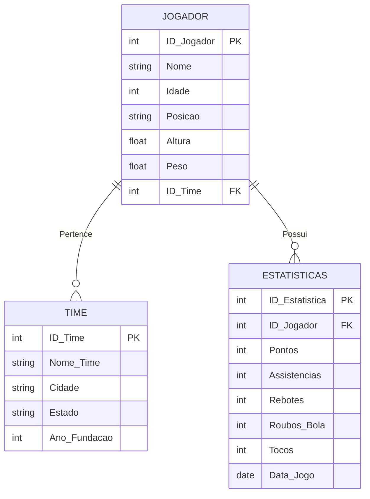

```mermaid
erDiagram
    JOGADOR {
        int ID_Jogador PK
        string Nome
        int Idade
        string Posicao
        float Altura
        float Peso
        int ID_Time FK
    }

    TIME {
        int ID_Time PK
        string Nome_Time
        string Cidade
        string Estado
        int Ano_Fundacao
    }

    ESTATISTICAS {
        int ID_Estatistica PK
        int ID_Jogador FK
        int Pontos
        int Assistencias
        int Rebotes
        int Roubos_Bola
        int Tocos
        date Data_Jogo
    }

    JOGADOR ||--o{ TIME : Pertence
    JOGADOR ||--o{ ESTATISTICAS : Possui
```